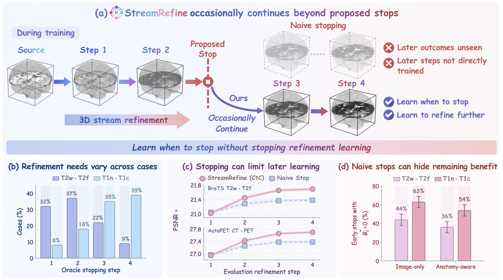
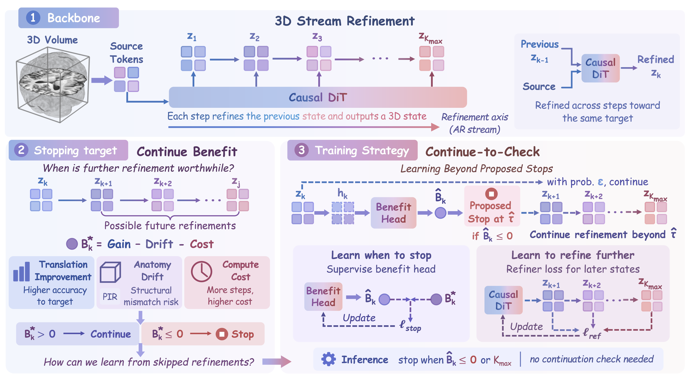

# StreamRefine

**StreamRefine** is a Continue-to-Check framework for **adaptive iterative 3D medical image translation**.

Our core idea is to treat learned stopping as both a **computation decision** and a **learning decision**. If training stops whenever the model proposes stopping, later refinement states are no longer observed or directly supervised. StreamRefine therefore occasionally continues beyond proposed stops, allowing the same trajectories to teach both **when to stop** and **how to refine further**.

<p align="center">
  
</p>

StreamRefine follows three main ideas:

- 🌊 **Stream Refinement**, which models translation as an autoregressive stream of successive 3D refinement states
- 📈 **Continue Benefit**, which estimates whether further refinement remains worthwhile
- 🔁 **Continue-to-Check**, which occasionally continues beyond proposed stops during training

By learning stopping and refinement together, StreamRefine improves the quality–efficiency trade-off while avoiding unnecessary refinement.

## 🔎 Overview

Iterative medical image translation can benefit from multiple refinement steps, but different cases may require different amounts of computation. A fixed refinement horizon can therefore either stop too early or refine longer than necessary.

A naive learned-stopping strategy creates another problem: once a trajectory stops during training, the later refinement outcomes are hidden and those later states receive no direct supervision.

StreamRefine addresses this by **occasionally continuing after a proposed stop**. These continued trajectories reveal whether additional refinement would still be useful and simultaneously provide supervision for otherwise skipped later refinements.

<p align="center">
  
</p>

## 💡 Key Ideas

<table>
  <thead>
    <tr>
      <th align="left" width="34%">Component</th>
      <th align="left">Description</th>
    </tr>
  </thead>
  <tbody>
    <tr>
      <td>🌊 <b>3D Stream Refinement</b></td>
      <td>Represents translation as a sequence of complete 3D latent refinement states, where each new state is conditioned on the source and previous model predictions.</td>
    </tr>
    <tr>
      <td>📈 <b>Continue Benefit</b></td>
      <td>Measures whether future refinement remains worthwhile by balancing translation improvement, anatomy-related structural change, and computation cost.</td>
    </tr>
    <tr>
      <td>🔁 <b>Continue-to-Check</b></td>
      <td>Occasionally overrides proposed stops during training so that later outcomes can supervise both the stopping head and otherwise skipped refinements.</td>
    </tr>
  </tbody>
</table>

Together, these components let StreamRefine learn case-dependent stopping without giving up the opportunity to learn useful later refinements.

## ✨ Features

<table>
  <thead>
    <tr>
      <th align="left" width="34%">Feature</th>
      <th align="left">Description</th>
    </tr>
  </thead>
  <tbody>
    <tr>
      <td>🧠 <b>Adaptive stopping</b></td>
      <td>Predicts when further refinement is no longer worthwhile instead of using one fixed number of steps for every case.</td>
    </tr>
    <tr>
      <td>🫀 <b>Anatomy-aware decisions</b></td>
      <td>Uses a lightweight structural proxy when constructing the stopping target so that refinement quality is balanced against unnecessary anatomical change.</td>
    </tr>
    <tr>
      <td>🔁 <b>Later-refinement learning</b></td>
      <td>Continued trajectories directly train refinement states that naive stopping would otherwise skip.</td>
    </tr>
    <tr>
      <td>⚖️ <b>Reach correction</b></td>
      <td>Reweights losses for later states according to how often they are reached under stochastic continuation.</td>
    </tr>
    <tr>
      <td>🚫 <b>GT-free inference</b></td>
      <td>The model stops using only the predicted Continue Benefit; no paired target, PIR computation, or continuation check is required at inference.</td>
    </tr>
    <tr>
      <td>🪟 <b>Whole-volume inference</b></td>
      <td>Supports synchronized sliding-window generation with shared volume-level stopping and KV caching.</td>
    </tr>
  </tbody>
</table>

## 📊 Experimental Scope

StreamRefine is evaluated on **10 translation tasks across 3 datasets**.

**BraTS 2024**
- T2w → T2f
- T1c → T1n
- T2f → T2w
- T1n → T2w
- T1n → T1c

**SynthRAD 2025**
- MRI → CT
- CBCT → CT
- CT → MRI

**AutoPET**
- CT → PET
- PET → CT

The experiments evaluate **translation quality**, **tumor/lesion ROI reconstruction**, **downstream segmentation**, and **computational efficiency**, together with mechanism analyses of later-refinement learning and stopping decisions.

## 🗂️ Data Preparation

Each row should identify the case, modality, image path, and split. Modalities from the same case must use the same split and be spatially aligned.

Before training, update the corresponding cache configuration under:

```text
ar/configs/cache/
```

with the dataset root, manifest path, and VidTok checkpoint information.

## 🛠️ Usage

### Installation

Use Python 3.11 and install a compatible PyTorch build, then install the remaining dependencies:

```bash
python -m pip install -r requirements.txt
```

### 1. Generate latent caches

For BraTS 2024:

```bash
python ar/tools/precompute_vidtok_kl_mean_latents.py \
  --dataset brats24 \
  --split all \
  --batch-size 1 \
  --num-workers 0 \
  --no-continue-on-error
```

For SynthRAD or AutoPET, replace `brats24` with `synthrad` or `autopet`.

### 2. Train StreamRefine

BraTS 2024:

```bash
python ar/train_streamrefine.py \
  --dataset-config ar/configs/streamrefine/datasets/brats24.yaml \
  --set data.pair=t2w_to_t2f \
  --output-dir result/runs/brats24_t2w_to_t2f
```

SynthRAD 2025:

```bash
python ar/train_streamrefine.py \
  --base-config ar/configs/streamrefine/base_synthrad.yaml \
  --dataset-config ar/configs/streamrefine/datasets/synthrad.yaml \
  --set data.pair=mr_to_ct \
  --output-dir result/runs/synthrad_mr_to_ct
```

AutoPET:

```bash
python ar/train_streamrefine.py \
  --base-config ar/configs/streamrefine/base_autopet.yaml \
  --dataset-config ar/configs/streamrefine/datasets/autopet.yaml \
  --set data.pair=ct_to_pet \
  --output-dir result/runs/autopet_ct_to_pet
```

Available translation pairs are defined in the corresponding dataset YAML files.

### 3. Inference

For BraTS 2024 T2w → T2f:

```bash
python ar/infer_sliding_window_streamrefine.py \
  --dataset-config ar/configs/streamrefine/datasets/brats24.yaml \
  --set data.pair=t2w_to_t2f \
  --checkpoint result/runs/brats24_t2w_to_t2f/best.pt \
  --output-dir result/predictions/brats24_t2w_to_t2f
```

For SynthRAD or AutoPET, use the same base and dataset configurations as during training.
